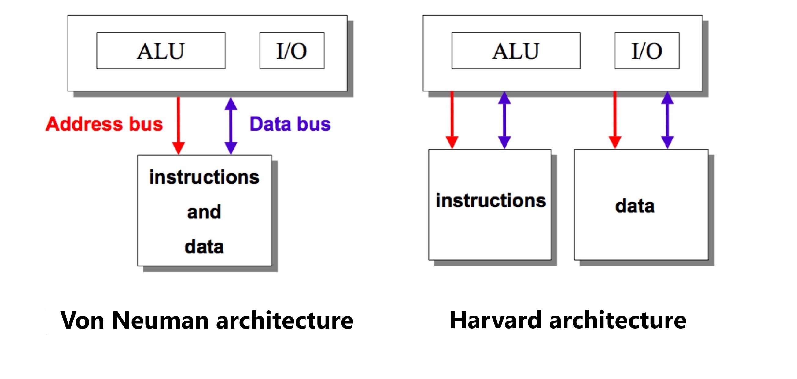

# CN210 FUNDAMENTAL OF COMPUTER ARCHITECTURE
## วพ.210 สถาปัตยกรรมคอมพิวเตอร์

**Computer** ประกอบด้วย

1.Central Processing Unit (CPU) เป็นหน่วยประมวลผลกลางซึ่งประกอบด้วย 

  * Artimetric and Logic Unit (ALU) ตัวคำนวนทางคณิตศาสตร์และตรรกศาสตร์  
  
  * Register เก็บข้อมูลระหว่างคำนวน
  
  * Control Unit หน่วยควบคุม
  
2.Main Memory หน่วยความจำหลัก

3.Input/Output ตัวรับค่าหรือแสดงผล

## 

**คอมพิวเตอร์แบบ Vonneuman และ Harvard**
 * Vonneuman ข้อมูล(Data) และชุดคำสั่ง(Instruction)จะถูกเก็บบนหน่วยความจำเดียวกัน
 * Harvard ข้อมูล(Data) และชุดคำสั่ง(Instruction)จะถูกเก็บคนละหน่วยความจำ
 


ในวิชานี้เลือกศึกษา โปรเซสเซอร์ที่มีสถาปัตยกรรมแบบ **MIPS**

ทุกคำสั่งใน สถาปัตยกรรมแบบ MIPS มีขนาด 32 bit

**MIPS Instruction** แบ่งออกเป็น 3 ประเภท ดังนี้

1. **R-Format** เป็นคำสั่งประเภทที่ใช้คำนวน แบ่งเป็น 6 ส่วน

|op | rs | rt | rd | shamt | func |
|---|---|---|---|---|---|
|6-bit|5-bit|5-bit|5-bit|5-bit|6-bit|

ตัวอย่าง : *func $rd, $rs, $rt*

2. **I-Format** ใช้ในการเคลื่อนย้ายข้อมูล แบ่งเป็น 4 ส่วน 

|op | rs | rt | value or offset |
|---|---|---|---|
|6-bit|5-bit|5-bit|16-bit|

ตัวอย่าง : *lw $rt, offset($rs)* , *sw $rt, offset($rs)*

3. **J-Format** ใช้ในการ jump จากตำแหน่ง Address ปัจจุบันไปยังอีกตำแหน่งหนึ่ง แบ่งเป็น 2 ส่วน 
   
|op | absolute address |
|---|---|
|6-bit|26-bit|

ตัวอย่าง : *j address*


## **CLIP 1 R-Format** [(https://youtu.be/-u3ELDG5a7I)](https://youtu.be/-u3ELDG5a7I) 


## **CLIP 2 CPU** [(https://youtu.be/NWCN2Y-DYX4)](https://youtu.be/NWCN2Y-DYX4) 


## **CLIP 3 Single cycle VS Multi-cycle** [(https://youtu.be/GuDT-ue4UV4)](https://youtu.be/GuDT-ue4UV4) 

| Single-cycle | Multi-cycle |
| --- | --- |
| ALU 3 ตัว | ALU 1 ตัว |
| Memory 2 ตัว | Memory 1 ตัว |
| ทำงานจบใน 1 cycle ต่อ 1 คำสั่ง | 1คำสั่งไม่ได้ทำงานจบได้ใน 1 cycle |
| ทุกคำสั่งใช้เวลาในการประมวลผลเท่ากัน | แต่ละคำสั่งใช้เวลาในการประมวลผลไม่เท่ากัน |

**Single cycle** : 


**Multi-cycle**  : 


## **CLIP 4 lw in Multi-cycle** [(https://youtu.be/UYCXfCff6dE)](https://youtu.be/UYCXfCff6dE)

อธิบายคำสั่ง lw แบบ multi-cycle  

คำสั่ง lw ใน muti-cycle มีทั้งหมด 5 cycle ดังนี้

  * T1 - อ่านค่าว่า PC ชี้ไปที่ Address ใดใน Memory แล้วนำไปเก็บไว้ที่ Instruction Register นำค่า PC มาบวก 4 เพื่อทำคำสั่งถัดไป
        
  * T2 - นำข้อมูลที่ register rs ไปเก็บไว้ที่ A นำข้อมูลที่ register rt ไปเก็บไว้ที่ B   
        
  * T3 - นำค่าที่ A มาบวกกับ offset แล้วเก็บผลลัพธ์ที่ได้ไว้ใน ALUout
   
  * T4 - นำผลลัพธ์จาก ALUout มาเก็บไว้ที่ Memory data register
   
  * T5 - นำค่าที่เก็บไว้ที่ Memory data register มาเก็บใน register rt ซึ่งคือ B
   
## **CLIP 5 beq in Multi-cycle** [(https://youtu.be/htB5g3B2tR0)](https://youtu.be/htB5g3B2tR0) 

อธิบายคำสั่ง beq แบบ multi-cycle

ซึ่งใน muti-cycle คำสั่ง beq มีทั้งหมด 3 cycle ดังนี้

  * T1 - อ่านค่า PC ว่าชี้ไปที่ Address ใดใน Memory แล้วนำไปเก็บที่ Instruction Register และนำ PC ปัจจุบันบวก 4 เพื่อเตรียมทำคำสั่งถัดไป
        
  * T2 - นำข้อมูลที่ register rs ไปเก็บไว้ที่ A นำข้อมูลที่ register rt ไปเก็บไว้ที่ B
        
  * T3 - นำค่าที่ A และ B มาเปรียบเทียบกัน หากเท่ากันจะส่งผลลัพธ์ไปเก็บใน ALUout ถ้าไม่เท่ากันจะข้ามไปทำคำสั่งถัดไป

## **CLIP 6 control signal R-format** [(https://youtu.be/SFvhhpdckLI)](https://youtu.be/SFvhhpdckLI) 

อธิบายการทำงาน control signal ของคำสั่ง R-format มีทั้งหมด 4 cycle ดังนี้ 

```
   T1 - MemRead = 1                   Memory มีการใช้งาน
        IorD = 1                      อ่านว่าปัจจุบัน PC ชี้ไปที่ Address ใดใน Memory
        IRWrite = 1                   นำMemory ที่ถูกชี้ไปเก็บไว้ที่ Instruction Register
        ALUSrcA = 0                   Mux เลือกค่าจาก 0 ซึ่งคือ PC
        ALUSrcB = 1                   Mux เลือกค่าจาก 1 ซึ่งคือ 4
        ALUOP = ADD                   ทำการคำนวณโดยการบวกค่า PC กับ 4
        PCWrite = 1, PCSource = 1     นำผลลัพธ์การคำนวณเขียนทับ PC ปัจจุบัน
   T2 - ALUSrcA = 0                   Mux เลือกค่าจาก 0 ซึ่งคือ PC
        ALUSrcB = 3                   Mux เลือกค่าจาก 3 ซึ่งคือ offset
        ALUOP = 0                     ทำการคำนวณโดยการบวกค่า PC กับ offset
   T3 - ALUSrcA = 1                   Mux เลือกค่าจาก 1 ซึ่งคือ register rs
        ALUSrcB = 0                   Mux เลือกค่าจาก 0 ซึ่งคือ register rt
        ALUOP = 2                     ทำการคำนวณโดย func เป็นตัวกำหนดว่าจะคำนวณโดยวิธีใด
   T4 - RegWrite = 1                  นำ ALUout มาเขียนใน register rd
        MemtoReg = 0                  Mux เลือกค่าจาก 0 ซึ่งคือ ALUout
        RegDst = 1                    Mux เลือกค่าจาก 1 ซึ่งคือ register rd
   
```
## **CLIP 7 Pipelining** [(https://youtu.be/ulkBgRpX9ic)](https://youtu.be/ulkBgRpX9ic) 

Pipeline คือ Memory ที่เก็บเฉพาะชุดคำสั่ง โดยจะมีการลำดับคำสั่งให้มีความรวดเร็วในการประมวลผลเพิ่มขึ้น เรียกว่า Pipelining หลักการคือ ในแต่ละคำสั่งจะมีการซ้อนทับกัน

เปรียบเทียบจากภาพโดยให้ 1 คำสั่ง คือ ผ้า 1 ถุง โดยในแต่ละคำสั่งจะมีขั้นตอนการทำงาน หรือการจัดการผ้าแต่ละถุงจะมีขั้นตอนวิธีการแต่ละขั้น ยกตัวอย่างการเปรียบเทียบการทำงานของ Pipelining ดังภาพต่อไปนี้


ใช้เวลารวม 8 ชั่วโมง


ใช้เวลารวม 3.5 ชั่วโมง
